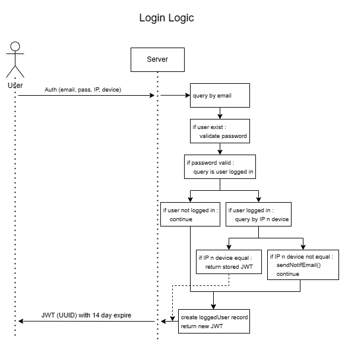

# ADVANCE AUTH with Golang
This is a personal project I created for learning the Go programming language. I built this project over 3 days with no prior experience or knowledge of the Go language. I used online resources such as YouTube for basic concepts and project flow. I also learned about working with databases by reading the documentation provided by the library. All the features in this project were developed from scratch based on my own ideas and have not been implemented in real-world cases before.

## Tech Stack
- Programming Language: [GO](https://go.dev/)
- Database: [PostgreSQL](https://www.postgresql.org/)
- Database Driver: [Gorm](https://gorm.io/)

## Routes
- /auth/login - For user login
- /auth/logout - For user logout
- /auth/isLogin - To check if a user is already logged in
- /user/register - To create a new account
- /update/username - To update the username of an account
- /resetpw/request - To request a password reset token
- /resetpw/validate - To validate the password reset token
- /resetpw/reset - To reset the password
- /verify/resend - To resend an account verify link
- /verify/validate - To validate the verify token

## Feature
- Middleware - Auth middleware feature using JSON Web Token (JWT) that stores the user's UUID with an expiration date of 14 days.
- Mailer - Uses SMTP API to send emails to users.
- Check IP Address and Device when performing actions related to user account data.
- Email notifications if there is a login from a different IP Address or Device.
- Action termination if the JWT token stored in the client's browser is stolen and used by a different IP Address or Device, along with email notifications.
- Password reset with a reset link sent via email with a 10-minute time limit for using the reset token and a limit of 3 request attempts with a 10-minute cooldown.
- Automatic database migration by GORM using models.
- Account Validator - Users can still log in, but they will have a label 'is_verified.' Users can resend the verification token to their email with a limit of 3 times per day.

## Error Code
Equipped with Response Error Codes used in the API Response when an error occurs:
- [1] <b>REQ_WRONG_BODY_FORMAT</b> - Frontend sends a request with an incorrect body format.
- [2] <b>REQ_FIELD_ERROR</b> - Data duplication occurs that does not comply with the database field requirements.
- [3] <b>DB_QUERY_ERROR</b> - An error occurs in the database request.
- [4] <b>AUTH_MISSING_JWT</b> - Accessing the API without JWT.
- [5] <b>AUTH_WRONG_JWT</b> - Accessing the API with an incorrect JWT.
- [6] <b>AUTH_TOKEN_EXPIRED</b> - Accessing the API with an expired JWT.
- [7] <b>AUTH_EMAIL_NOT_FOUND</b> - Email used for login does not match the database.
- [8] <b>AUTH_WRONG_PASSWORD</b> - Incorrect password.
- [9] <b>AUTH_USER_NOT_LOGGEDIN</b> - User has not logged in.
- [10] <b>AUTH_DIFFERENT_IP_OR_DEVICE</b> - Action from a different IP Address or Device.
- [11] <b>RESETPW_INVALID_TOKEN</b> - Invalid Token during password reset.
- [12] <b>RESETPW_EXPIRED_TOKEN</b> - Expired Token during password reset.
- [13] <b>RESETPW_MAX_LIMIT_REQUEST</b> - Maximum limit for password reset requests.
- [14] <b>FAILED_GENERATE_JWT</b> - Failed to generate JWT.
- [15] <b>FAILED_ENCRYPT</b> - Failed to encrypt the password.
- [16] <b>VERIFY_INVALID_TOKEN</b> - Invalid token during validating account.
- [17] <b>VERIFY_MAX_LIMIT_REQUEST</b> - Maximum limit for verify resend.
- [18] <b>VERIFY_ALREADY_VERIFIED</b> - Resend a verifying token when user already verified.